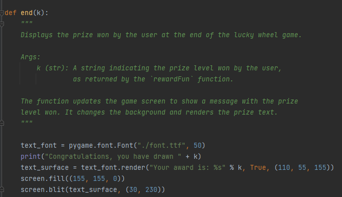
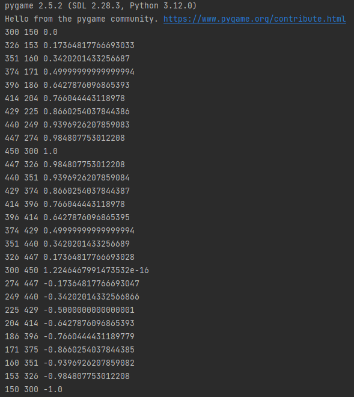
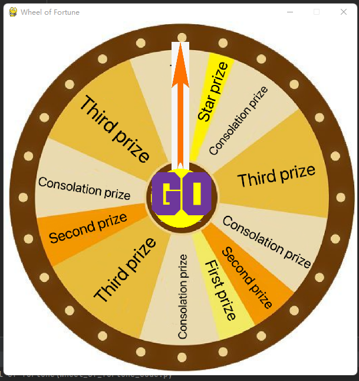
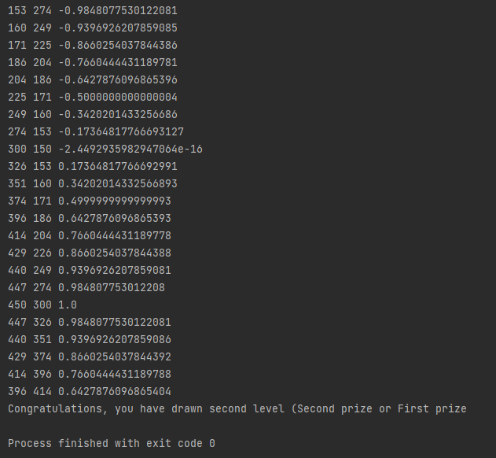
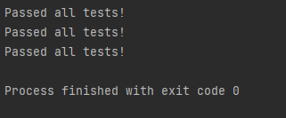
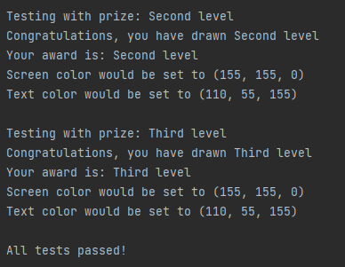
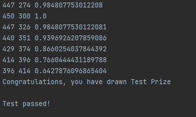
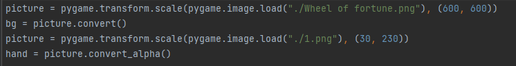
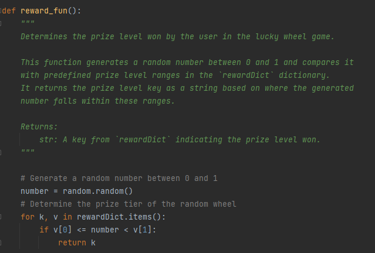
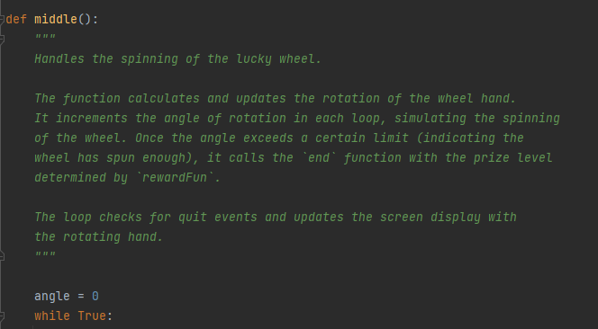

# Final Project Report

* Student Name:Jiongyi He
* Github Username:Jeffrey0906
* Semester:2023fall
* Course:5001

## Description 
General overview of the project, what you did, why you did it, etc. 
My project is a "Wheel of Fortune" game created using Pygame, a popular Python library for building games and multimedia applications. The game aims to provide a simple, interactive, and visually engaging experience.
The use of Pygame allows for easy graphics rendering and event handling, making it a suitable choice for developing this game.
The wheel spinning mechanism and random prize generation add elements of chance and anticipation, which are key to the game's appeal.
Building a game like Wheel of Fortune is an excellent way to learn and practice programming skills, especially in Python. It involves handling user inputs, implementing game logic, working with graphics, and using libraries like Pygame. Such a project is both challenging and engaging, making it an effective learning tool.Developing a game from scratch helps in understanding core game development concepts such as game loops, event handling, collision detection, and graphical rendering. This experience is valuable for anyone interested in game development or looking to enhance their software development skills in general.

## Key Features
Highlight some key features of this project that you want to show off/talk about/focus on. 
Graphical User Interface (GUI) Development: The project showcases my ability to create and manage a graphical user interface using Pygame. The game window setup, image rendering, and the creation of interactive elements like the spinning wheel and the indicator hand are significant aspects of GUI development.
Animation and Graphics Transformation: The spinning wheel effect is achieved through graphical transformations and animations. This involves calculating positions and angles to rotate the hand image, showcasing my ability to work with more advanced Pygame functionalities and mathematical concepts like trigonometry.
Randomization for Game Mechanics: Implementing the random prize allocation with rewardfun illustrates my skill in using randomization in game mechanics. This is a fundamental aspect of many games, contributing to replayability and unpredictability, which are key elements of engaging game design.
Modular Function Design: The project is structured into distinct functions (start, middle, end, rewardfun), each handling specific aspects of the game. This modular design not only makes the code more readable and maintainable but also demonstrates good coding practices.
Customization and Scalability: The game's design allows for easy customization and scalability. For instance, modifying the rewarddict can change the game's rewards and difficulty. This aspect of the project shows an understanding of designing flexible and adaptable systems.

## Guide
How do we run your project? What should we do to see it in action? - Note this isn't installing, this is actual use of the project.. If it is a website, you can point towards the gui, use screenshots, etc talking about features. 
Running the Game
Locate the Game Files: Make sure all your game files, including the Python script(s) and any image files (Wheel of fortune.png, 1.png), are in the same directory.
Open the Terminal or Command Prompt: Navigate to the directory where your game files are located using the terminal (Linux/macOS) or command prompt (Windows).
Run the Script.

Playing the Game
Once the game starts, you should see the game window with the Wheel of Fortune. Here's what to expect and how to interact with the game:
Initial Screen: The game will display the initial screen with the wheel and a "go" text. The wheel hand will be positioned at a starting point.
Starting the Game: Press spacekey to start spinning the wheel. The wheel hand will begin rotating around the wheel.
Spinning Wheel: Observe the spinning wheel. The hand will rotate, creating a sense of suspense as you wait to see on which prize it lands.
Determining the Prize: After a set amount of spinning (when the hand rotation stops), the game will determine your prize. This is where the rewardfun function comes into play, using a random number to select a prize tier from rewarddict.
Displaying the Result: The game will then display the prize you've won. This is handled by the end function, which updates the screen with a message showing your prize.
Exiting the Game: To exit the game, you can close the game window.

## Installation Instructions
If we wanted to run this project locally, what would we need to do?  If we need to get API key's include that information, and also command line startup commands to execute the project. If you have a lot of dependencies, you can also include a requirements.txt file, but make sure to include that we need to run `pip install -r requirements.txt` or something similar.
1. Install Python
First, ensure that you have Python installed. You can download it from the official Python website. This game should be compatible with Python 3.x versions.
2. Install Pygame
The game relies on the Pygame library for graphical rendering and event handling. Install Pygame via pip (Python's package installer). Open your command line or terminal and run:
pip install pygame
3. Obtain the Game Files
You'll need the Python script for the game and any associated assets (like images and font files). Make sure the following files are in your project directory:
Python script files (e.g., wheel_of_fortune_code.py)
Image files for the wheel (Wheel of fortune.png) and the hand (1.png)
Font file used in the game (Font.ttf)
4. Setting Up the Project Directory
Organize your project directory. It should contain:
The Python script(s) for the game.
The image and font files in the same directory as the script.

## Code Review
Go over key aspects of code in this section. Both link to the file, include snippets in this report (make sure to use the [coding blocks](https://github.com/adam-p/markdown-here/wiki/Markdown-Cheatsheet#code)).  Grading wise, we are looking for that you understand your code and what you did. 
At the beginning of my script, I set up the Pygame environment and the main game window:

pygame.init():  Initializes all the Pygame modules.
screen = pygame.display.set_mode((600, 600)):  Creates a window for displaying the game. Here, it's set to 600x600 pixels.
pygame.display.set_caption('Wheel of Fortune'):  Sets the title of the game window.

Then load and transform images for the game's background and the spinning hand:
pygame.image.load(): Loads an image from a file.
pygame.transform.scale(): Scales the loaded image to the specified size.
convert() and convert_alpha(): These are used to optimize the image for faster blitting (drawing) to the screen. convert_alpha() is used for images with transparency.

The rewardfun function determines the prize level won by the player:
This function generates a random number between 0 and 1.
It iterates through the rewarddict dictionary to find which prize range the random number falls into.
It returns the corresponding prize level.

start Function
Handles the initial game display and awaits user interaction to start the game:
The function enters an infinite loop, listening for events like key presses or window close.
It renders the initial game screen and waits for the player to press a key to start the game.

middle Function
Manages the spinning of the wheel:
It animates the spinning of the wheel by incrementally rotating the hand image.
Once the spinning stops (determined by the angle), it calls rewardfun to determine the prize, then end to display the result

end Function
Displays the prize won by the player:
It updates the game screen with a message indicating the prize level won.

### Major Challenges
Key aspects could include pieces that your struggled on and/or pieces that you are proud of and want to show off.

Implementing the Spinning Wheel Animation (middle function):
The animation of the spinning wheel is a central feature of the game. Getting the animation to look smooth and ensuring that the wheel stops in a way that feels random and fair can be quite challenging. This involves understanding Pygame's animation capabilities and applying trigonometric functions for rotation.

Random Prize Generation (rewardfun function):
Implementing a fair and unpredictable prize generation system is crucial for the game's excitement. Balancing the odds and understanding how to use the random library effectively can be challenging, especially to ensure a good distribution of prizes.

Modular and Readable Code Structure:
Organizing the code into distinct functions (start, middle, end, rewardfun) makes the project modular and easier to understand and maintain. This structure also demonstrates good programming practices and helps in debugging and future code enhancements.

Event Handling and Interactive Elements:
The game's ability to respond to user inputs, such as starting the game and handling quit events, showcases my skill in creating interactive applications. Understanding and implementing event handling is fundamental in game development.

## Example Runs
Explain how you documented running the project, and what we need to look for in your repository (text output from the project, small videos, links to videos on youtube of you running it, etc)

## Testing
How did you test your code? What did you do to make sure your code was correct? If you wrote unit tests, you can link to them here. If you did run tests, make sure you document them as text files, and include them in your submission. 

> _Make it easy for us to know you *ran the project* and *tested the project* before you submitted this report!_

To ensure the correctness and reliability of the Wheel of Fortune game code, a combination of manual testing and unit testing strategies were employed. Here's a detailed explanation of how the testing process was conducted:

Manual Testing
Running the Game: The game was repeatedly run to observe its behavior under various scenarios, such as starting the game, spinning the wheel, and exiting.

User Interaction: Testing included pressing different keys to ensure the game responds as expected, particularly the keypress to start the wheel and the ESC key to quit.

Visual Inspection: The graphical elements like the spinning wheel, text rendering, and layout were visually inspected for any anomalies or glitches.

Prize Distribution: The randomness of the prize distribution was observed over multiple runs to ensure it felt fair and unpredictable.

Error Handling: Attempted to induce errors, such as closing the game window unexpectedly, to ensure the game handles such scenarios gracefully.

## Missing Features / What's Next
Focus on what you didn't get to do, and what you would do if you had more time, or things you would implement in the future. 
Due to technical limitations, I can't determine the corresponding prize level according to the drop point of the pointer. The current image is just a decoration, used to add a sense of novelty and excitement to the user. The specific prize level depends on the random number generated. And the current image is too simple, because I drew it myself, not beautiful enough. In the future, I hope I can give the user a random buff before the game starts, such as increasing his probability of winning the first prize or reducing his probability of winning the third prize, so as to enhance the playability and excitement of the game. In terms of images, more beautiful images are used, and more real-time and realistic pointer animations are introduced to make users have a better experience 

## Final Reflection
Write at least a paragraph about your experience in this course. What did you learn? What do you need to do to learn more? Key takeaways? etc.

I have learned a lot of knowledge through this semester's study. I think 5001 is a very good Bridge course that really introduced me to the world of computer science. And I think Mr. Albert is a very good teacher. He can arrange classes and leisure time for us flexibly. The pressure of study is not too great, but we can really learn skills. And the things taught are closely related to future employment, which is of great benefit to our personal development and job hunting in the future. 
But at the same time, when I finished the daily homework and the final homework, I realized my lack of ability. There are many things that I hope to achieve because my knowledge is too little and too shallow. Although I have a certain understanding by reading and learning other people's code on github, I still can't grasp the essence of other people's code and can't flexibly apply it to my own homework, which is what I need to improve in the future. I must learn to really learn from other people's code, and integrate it into my own use, so as to really improve my personal programming ability. The course of computer science requires me to continuously improve my ability through continuous reading and learning. This subject is a lifelong learning course, and I am ready to study all the time and for a long time.
I would like to express my sincere thanks to all the teachers I have met this semester, all the TA's, and all the students who have helped me. In the weekly group meeting, we actively discussed and solved the problems of the course, and completed the weekly activity work together. When I encountered difficulties in daily classes, I always had my classmates around me to answer my questions when I didn't understand them, which was very helpful to my academic progress. I am really grateful to all of you for coming all the way this semester.
